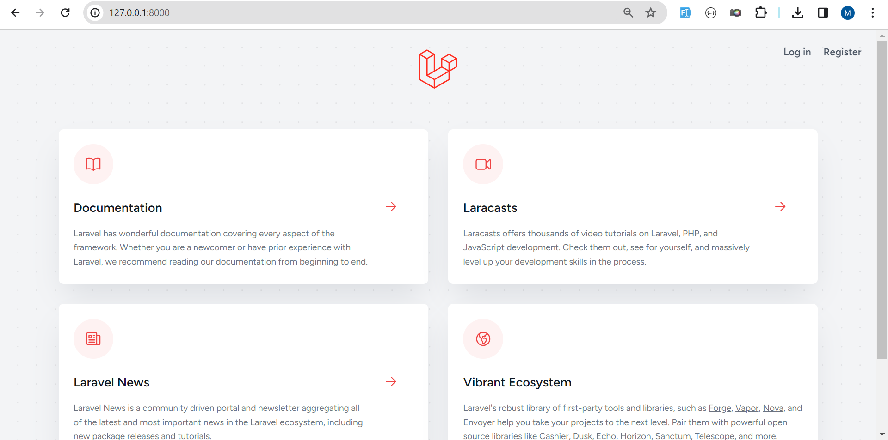
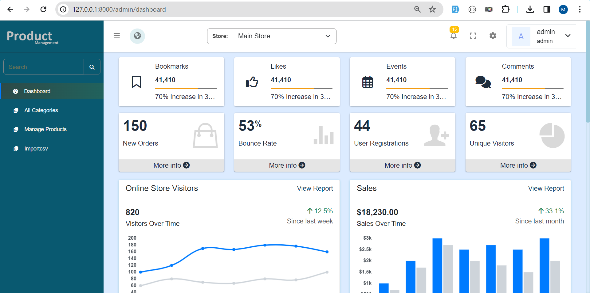
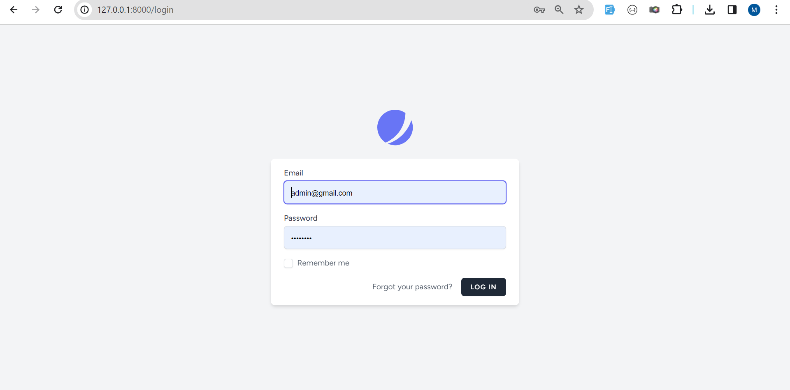
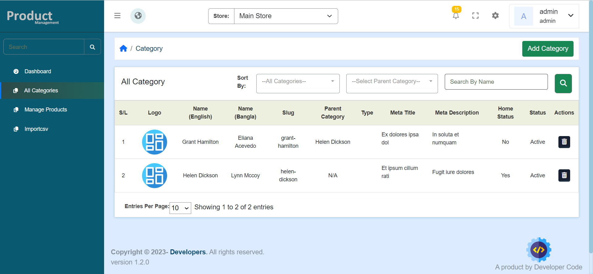
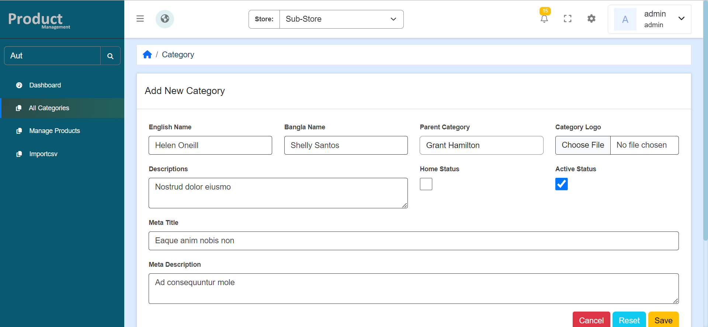
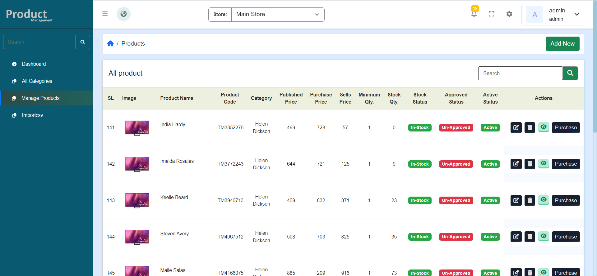
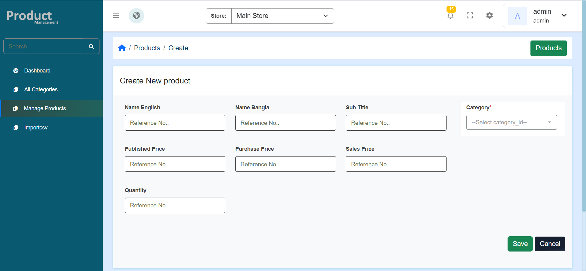
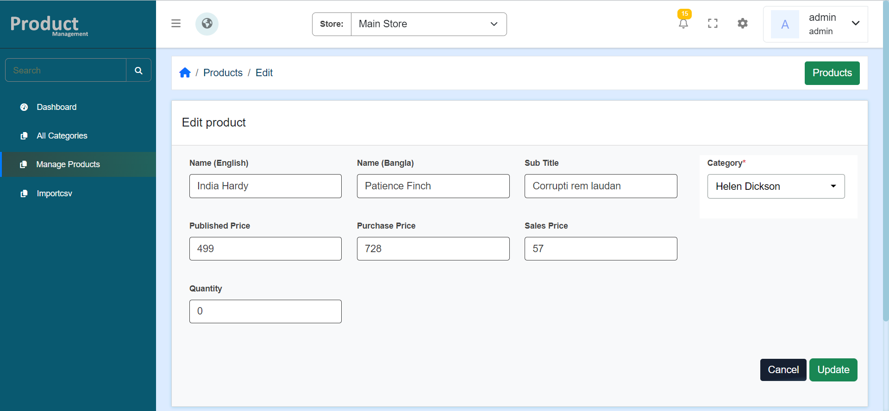
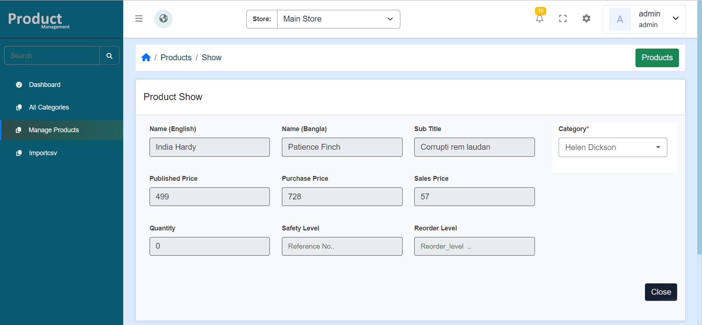
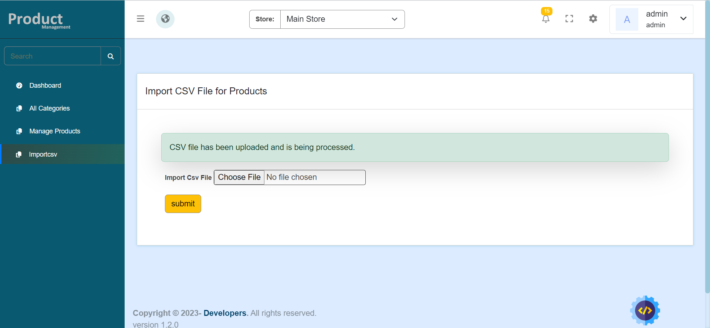

# Task 01

## Project Setup

### Clone the Repository

To get started, clone the repository by running the following command:

```
git clone <repository_url>
```

```
cd project_directory
```

```
cp .env.example .env
```

Setup Database, database sql file in project folder.

```
composer update
```

```
php artisan key:generate
```

```
npm install
```

```
npm run dev
```

```
php artisan optimize
```

login url:
http://127.0.0.1:8000/login

homepage:


Dashboard:


Login:


dashboard.png


category-list


create-new-category


product-list


create-product


edit-product


view-product


upload csv-1


success-csv-1

